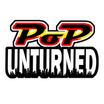

  

  # 🎮 PoPUnturned Roleplay Launcher

  **Launcher oficial de alto rendimiento y diseño ultra-moderno para el servidor PoPUnturned Roleplay.**

  
  
  
  

   

  [📥 Descargar Última Versión (PoPUnturnedSetup.exe)](https://github.com/JordiOrozco/PoPLauncher/releases/latest/download/PoPUnturnedSetup.exe) •
  [🌐 Sitio Web](https://popunturned.com) •
  [💬 Discord](https://discord.popunturned.com)

---

## 🌟 Características Principales

<table>
  <tr>
    <td width="50%">
      <h3>🚀 Conexión en 1-Clic a Unturned</h3>
      
Lanzamiento automático de Unturned a través de la API URI de Steam y conexión directa a la IP e interfaz del servidor de PoPUnturned Roleplay sin necesidad de introducir IP o puerto manualmente.

    </td>
    <td width="50%">
      <h3>📡 Estado de Servidor y Jugadores en Vivo</h3>
      
Consulta en tiempo real mediante protocolo A2S (Steam Server Query) del número de jugadores conectados, capacidad del servidor, estado ONLINE/OFFLINE y lista con los nombres de los usuarios activos.

    </td>
  </tr>
  <tr>
    <td width="50%">
      <h3>🔊 Control del Volumen de Vehículos</h3>
      
Slider exclusivo en el menú de opciones para modificar directamente la clave <code>Vehicle_Engine_Volume_Multiplier</code> en el archivo <code>Preferences.json</code> de Unturned, ofreciendo control absoluto sobre el ruido del motor.

    </td>
    <td width="50%">
      <h3>🔄 Auto-Updater Integrado</h3>
      
Sistema de actualización automática sin intervención manual. Al haber una nueva versión en GitHub Releases, el launcher la detectará, mostrará una barra de progreso animada de descarga y aplicará el nuevo instalador de forma transparente.

    </td>
  </tr>
  <tr>
    <td width="50%">
      <h3>📂 Rutas de Steam Personalizables</h3>
      
Selector de carpetas con explorador de archivos de Windows para ubicar Unturned o la carpeta de Mods de Workshop (304930) en discos secundarios o rutas personalizadas (ej. <code>D:\SteamLibrary...</code>).

    </td>
    <td width="50%">
      <h3>🎵 Reproductor de Música Lo-Fi Chill</h3>
      
Música de ambiente relajante (libre de copyright) integrada con control de encendido/silenciado rápido en la barra superior y regulador de volumen independiente en las opciones.

    </td>
  </tr>
</table>

---

## 🎨 Diseño Visual y Redes Sociales

El launcher cuenta con una interfaz **Glassmorphism de alta fidelidad** basada en un tema oscuro con tonos carmesí y dorado:

- **Iconografía Oficial Vectorial**: Enlaces interactivos a las redes oficiales con SVG vectoriales nítidos:
  - 💬 **Discord**
  - 🌐 **Sitio Web Oficial**
  - ▶️ **YouTube**
  - 🎵 **TikTok**
  - 𝕏 **Twitter / X**
  - 📸 **Instagram**
- **🧹 Limpiador de Mods**: Botón directo en la sección de opciones para vaciar la caché descargada de la Workshop (ID 304930) y solucionar conflictos de mods corruptos o desactualizados.

---

## 💻 Requisitos del Sistema

- **Sistema Operativo**: Windows 10 / Windows 11 (64-bit)
- **Juego Base**: Unturned instalado en Steam (AppID `304930`)
- **Runtime**: Incluido de forma nativa en el instalador (basado en .NET 8 Desktop Runtime).

---

## 🛠️ Tecnologías Utilizadas

- **Lenguaje**: C# 12
- **Framework**: .NET 8.0 Windows (WPF)
- **Protocolo de Servidor**: Steam A2S Master Server Query (UDP)
- **Serialización**: `System.Text.Json` / `System.Text.Json.Nodes`
- **Audio**: `System.Windows.Media.MediaPlayer` (Lo-Fi Ambient Stream)

---

## 📝 Licencia

Este proyecto está distribuido bajo la licencia MIT. Consulta el archivo [LICENSE](LICENSE) para más detalles.

  Desarrollado con ❤️ para la comunidad de <b>PoPUnturned Roleplay</b>.

